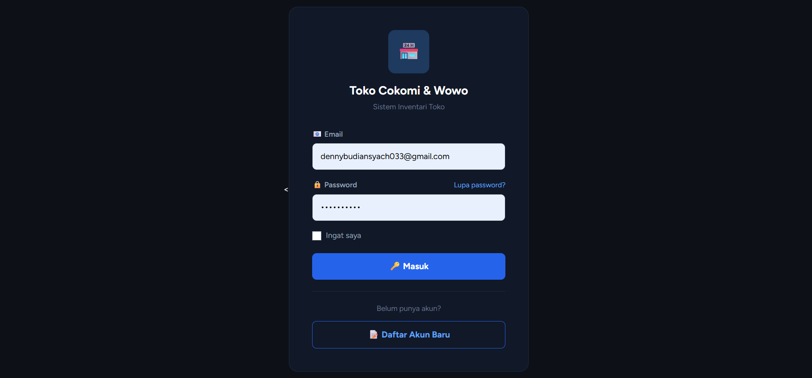
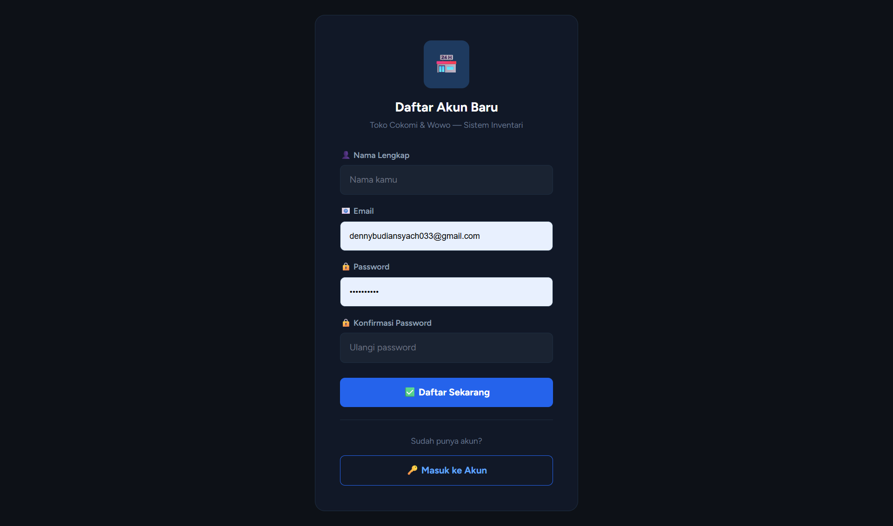
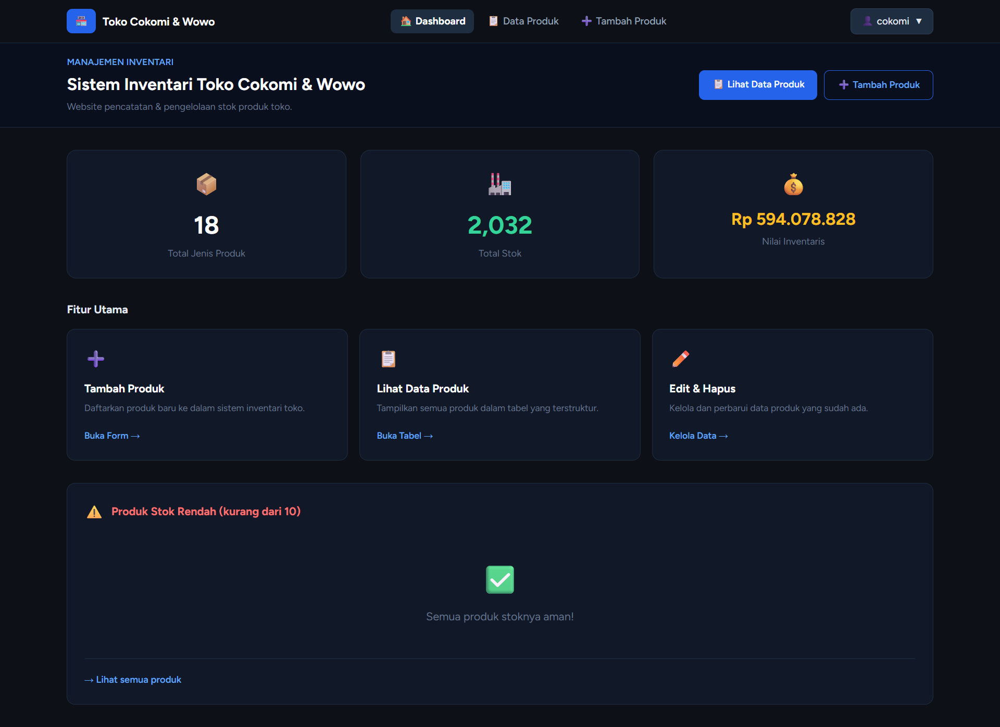
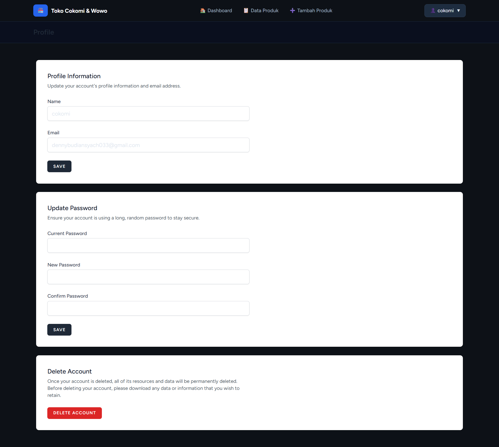
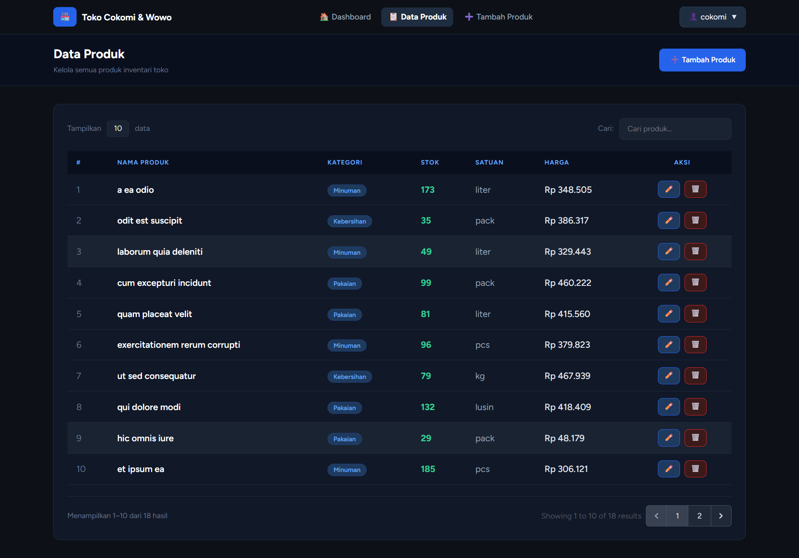
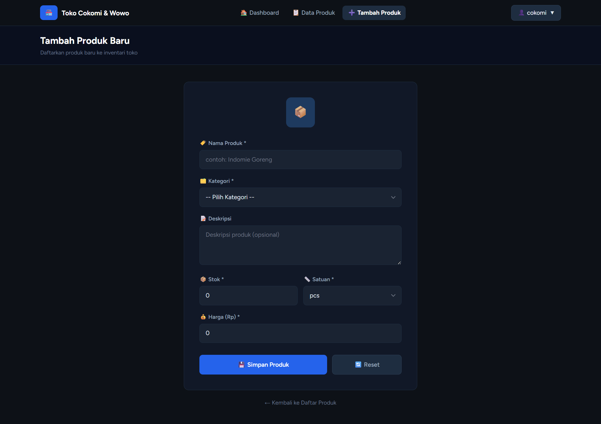
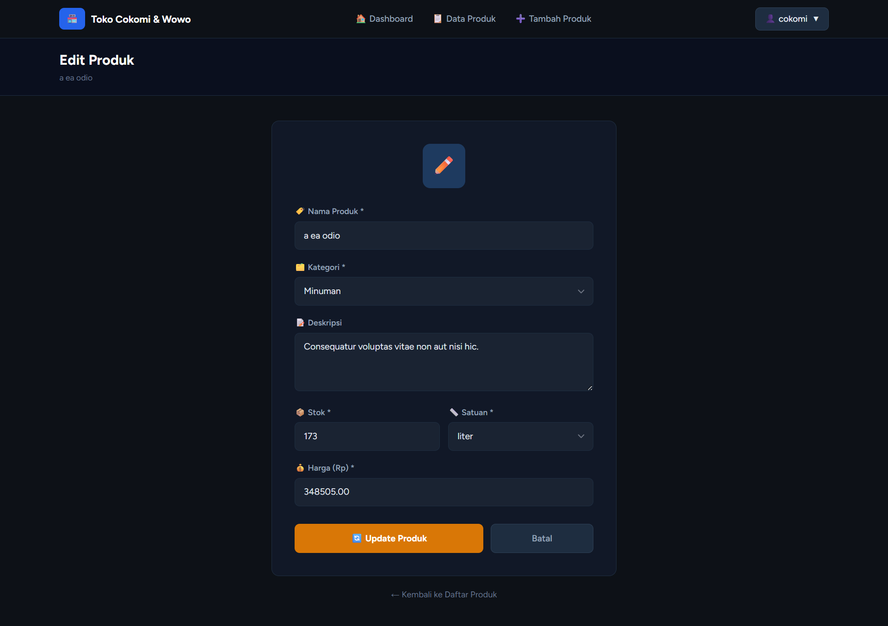
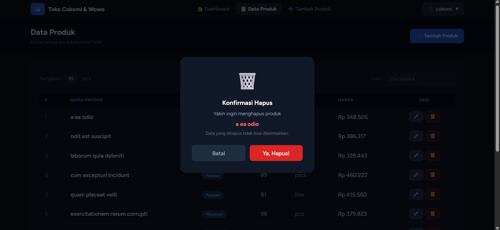

# Inventari Toko  Tedi x Wowo

> Aplikasi web manajemen inventari berbasis **Laravel 11** untuk mengelola stok produk toko milik Pak wowo dan Mas Tedi.

---

## Daftar Isi

- [Tentang Project](#tentang-project)
- [Teknologi](#teknologi)
- [Fitur](#fitur)
- [Struktur Database](#struktur-database)
- [Cara Instalasi](#cara-instalasi)
- [Cara Penggunaan](#cara-penggunaan)
- [Dokumentasi Tampilan](#dokumentasi-tampilan)
- [Informasi Developer](#informasi-developer)

---

## Tentang Project

Project ini dibuat sebagai tugas mata kuliah **Praktikum ABP** dengan tujuan membangun sistem inventari toko berbasis web menggunakan framework Laravel.

---

## Teknologi

| Teknologi | Versi | Keterangan |
|-----------|-------|------------|
| PHP | 8.3+ | Bahasa pemrograman utama |
| Laravel | 11.x | PHP Framework |
| Laravel Breeze | 2.x | Starter kit autentikasi |
| MySQL | 8.0+ | Database |
| Tailwind CSS | 3.x | CSS Framework |
| Alpine.js | 3.x | JavaScript (bawaan Breeze) |
| Vite | - | Asset bundler |

---

## Fitur

### Autentikasi (Laravel Breeze)
- Halaman **Login** dengan tampilan dark mode
- Halaman **Register** untuk pendaftaran akun baru
- Sistem **Logout** yang aman
- Proteksi route — halaman produk hanya bisa diakses setelah login

### Dashboard
- Kartu statistik **Total Produk** (jumlah jenis produk)
- Kartu statistik **Total Stok** (jumlah unit keseluruhan)
- Kartu statistik **Nilai Inventaris** (estimasi total nilai stok)
- Tabel **Produk Stok Rendah** (peringatan stok < 10 unit)
- Navigasi cepat ke fitur utama

### Manajemen Produk (CRUD)
- **Create** — Form tambah produk baru dengan validasi
- **Read** — Data table produk dengan pagination (10 data/halaman)
- **Update** — Form edit produk dengan data pre-filled
- **Delete** — Hapus produk dengan konfirmasi modal

### Tampilan
- Desain **dark mode** modern (tema biru navy)
- Tabel responsif dengan fitur **pencarian real-time**
- **Modal konfirmasi** sebelum menghapus data
- Notifikasi sukses setiap operasi CRUD
- Indikator **stok rendah** berwarna merah pada tabel

### Data Dummy
- **Database Factory** untuk generate data produk acak
- **Database Seeder** mengisi 20 produk dummy otomatis

---

## Struktur Database

### Tabel `users` (bawaan Breeze)
| Kolom | Tipe | Keterangan |
|-------|------|------------|
| id | bigint | Primary key |
| name | varchar | Nama pengguna |
| email | varchar | Email (unique) |
| password | varchar | Password (hashed) |
| created_at | timestamp | Waktu dibuat |
| updated_at | timestamp | Waktu diupdate |

### Tabel `products`
| Kolom | Tipe | Keterangan |
|-------|------|------------|
| id | bigint | Primary key |
| name | varchar(255) | Nama produk |
| category | varchar(100) | Kategori produk |
| description | text | Deskripsi produk |
| stock | integer | Jumlah stok |
| price | decimal(12,2) | Harga satuan |
| unit | varchar(50) | Satuan (pcs, kg, liter, dll) |
| created_at | timestamp | Waktu dibuat |
| updated_at | timestamp | Waktu diupdate |

---

## Cara Instalasi

### Prasyarat
Pastikan sudah terinstall:
- **PHP** >= 8.2
- **Composer**
- **Node.js** & NPM
- **MySQL** (via Laragon/XAMPP/dll)

---

### 1. Clone Repository

```bash
git clone https://github.com/USERNAME/inventari-toko.git
cd inventari-toko
```

### 2. Install Dependensi PHP

```bash
composer install
```

### 3. Install Dependensi Node.js

```bash
npm install
```

### 4. Konfigurasi Environment

```bash
cp .env.example .env
php artisan key:generate
```

Edit file `.env`, sesuaikan bagian database:

```env
DB_CONNECTION=mysql
DB_HOST=127.0.0.1
DB_PORT=3306
DB_DATABASE=inventari_toko
DB_USERNAME=root
DB_PASSWORD=
```

### 5. Buat Database

Buat database baru bernama `inventari_toko` di MySQL/HeidiSQL/phpMyAdmin.

### 6. Jalankan Migrasi & Seeder

```bash
php artisan migrate
php artisan db:seed
```

> Perintah ini akan membuat semua tabel dan mengisi **20 data produk dummy** secara otomatis.

### 7. Build Assets

```bash
npm run build
```

### 8. Jalankan Server

```bash
php artisan serve
```

Buka browser dan akses: **http://localhost:8000**

---

## Cara Penggunaan
1. Buka **http://localhost:8000/register**
2. Daftar akun baru (nama, email, password)
3. Setelah register, otomatis masuk ke **Dashboard**

### Mengelola Produk
| Aksi | Cara |
|------|------|
| Lihat semua produk | Klik menu **Data Produk** di navbar |
| Tambah produk baru | Klik tombol **➕ Tambah Produk** atau menu navbar |
| Edit produk | Klik tombol **✏️** pada baris produk |
| Hapus produk | Klik tombol **🗑️** → konfirmasi di modal |
| Cari produk | Ketik di kolom **Cari** pada tabel |

### Kategori Produk yang Tersedia
`Makanan` · `Minuman` · `Kebersihan` · `Elektronik` · `Pakaian` · `Lainnya`

### Satuan yang Tersedia
`pcs` · `kg` · `liter` · `lusin` · `pack` · `box`

---

## Dokumentasi Tampilan

### Halaman Login


### Halaman Register


### Dashboard


### Halaman Profile


### Data Produk (Tabel)


### Form Tambah Produk


### Form Edit Produk


### Modal Konfirmasi Hapus


---

## Struktur Project

```
inventari-toko/
├── app/
│   ├── Http/Controllers/
│   │   └── ProductController.php   # Controller CRUD produk
│   └── Models/
│       └── Product.php             # Model produk
├── database/
│   ├── factories/
│   │   └── ProductFactory.php      # Factory data dummy
│   ├── migrations/
│   │   └── xxxx_create_products_table.php
│   └── seeders/
│       ├── DatabaseSeeder.php
│       └── ProductSeeder.php       # Seeder 20 produk dummy
├── resources/views/
│   ├── auth/
│   │   ├── login.blade.php         # Halaman login (dark mode)
│   │   └── register.blade.php      # Halaman register (dark mode)
│   ├── layouts/
│   │   ├── app.blade.php           # Layout utama
│   │   └── navigation.blade.php   # Navbar
│   ├── products/
│   │   ├── index.blade.php         # Tabel daftar produk
│   │   ├── create.blade.php        # Form tambah produk
│   │   └── edit.blade.php          # Form edit produk
│   └── dashboard.blade.php         # Dashboard statistik
├── routes/
│   └── web.php                     # Definisi route
├── dokumentasi/                    # Screenshot tampilan
└── README.md
```

---
