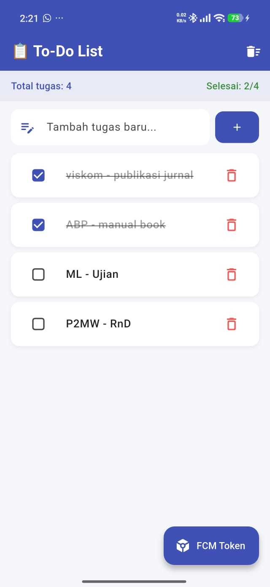
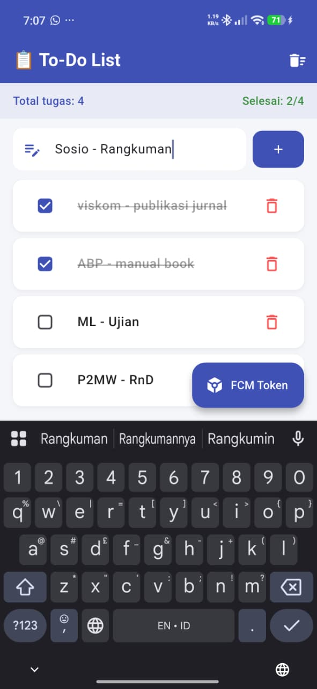
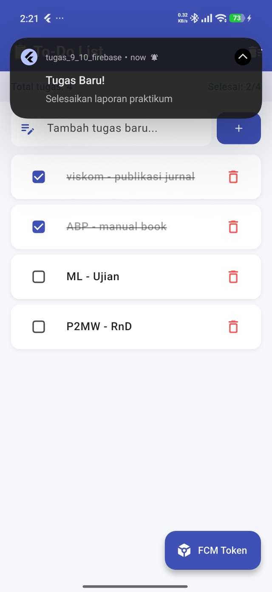

# Tugas Praktik Modul 12 & 13
## Todo List dengan State Management Provider & Firebase Cloud Messaging (FCM)

**Nama Project:** `tugas_9_10_firebase`  
**Mata Kuliah:** Aplikasi Berbasis Platform  
**Teknologi:** Flutter, Provider, Firebase Cloud Messaging

---

## Deskripsi Aplikasi

Aplikasi Flutter sederhana berbasis Android yang mengimplementasikan dua konsep utama:

1. **State Management dengan Provider** — mengelola daftar tugas (To-Do List) secara reaktif menggunakan `ChangeNotifier`, sehingga UI otomatis diperbarui setiap kali data berubah tanpa perlu `setState` manual.

2. **Firebase Cloud Messaging (FCM)** — mengintegrasikan push notification dari Firebase, memungkinkan pengiriman notifikasi ke perangkat dari Firebase Console maupun Postman, baik saat aplikasi aktif di foreground maupun berjalan di background.

---

## Fitur Aplikasi

| Fitur | Keterangan |
|-------|-----------|
| Tambah tugas | Ketik di input field → tekan Enter atau tombol `+` |
| Tandai selesai | Tap checkbox → teks berubah menjadi strikethrough |
| Hapus satu tugas | Swipe kiri pada item, atau tap ikon 🗑 |
| Hapus semua tugas | Tap ikon 🗑 di AppBar → dialog konfirmasi |
| Statistik tugas | Header menampilkan total tugas dan jumlah yang selesai |
| FCM Foreground | Notifikasi muncul sebagai popup sistem + SnackBar di dalam app |
| FCM Background | Notifikasi muncul di status bar Android secara otomatis |
| Lihat & salin token | Tap tombol **FCM Token** di pojok kanan bawah |

---

## Struktur Project

```
lib/
├── main.dart           → Entry point: inisialisasi Firebase + FCM listeners
├── todo_provider.dart  → State management: ChangeNotifier untuk data tugas
├── fcm_service.dart    → Setup Firebase Messaging & local notification
└── home_page.dart      → UI utama: daftar tugas, input, statistik
```

---

## Penjelasan Implementasi

### 1. State Management — Provider

State tugas dikelola oleh class `TodoProvider` yang meng-extend `ChangeNotifier`. Setiap perubahan data (tambah, hapus, toggle) memanggil `notifyListeners()` sehingga widget yang menggunakan `Consumer<TodoProvider>` otomatis di-rebuild.

```dart
// Contoh: tambah tugas
void addTodo(String title) {
  _todos.add(TodoItem(
    id: DateTime.now().millisecondsSinceEpoch.toString(),
    title: title.trim(),
  ));
  notifyListeners(); // UI otomatis update
}
```

Provider didaftarkan di root aplikasi menggunakan `MultiProvider` agar dapat diakses dari seluruh widget tree:

```dart
MultiProvider(
  providers: [
    ChangeNotifierProvider(create: (_) => TodoProvider()),
    ChangeNotifierProvider(create: (_) => FcmTokenProvider()),
  ],
  child: const MyApp(),
)
```

### 2. Firebase Cloud Messaging (FCM)

FCM diinisialisasi di `main()` sebelum `runApp()`. Terdapat tiga kondisi penerimaan notifikasi yang ditangani:

- **Foreground** (`onMessage`) — notifikasi ditampilkan via `flutter_local_notifications` + SnackBar
- **Background** (`onBackgroundMessage`) — ditangani oleh top-level handler `firebaseMessagingBackgroundHandler`
- **Terminated** (`getInitialMessage`) — dicek saat app pertama kali dibuka dari notifikasi

```dart
// Foreground listener
FirebaseMessaging.onMessage.listen((RemoteMessage message) {
  FcmService.showLocalNotification(message);
});
```

---

## Screenshot

### 1. Tampilan Daftar Tugas



Tampilan utama aplikasi menampilkan daftar tugas yang dikelola oleh Provider. Header menunjukkan statistik total tugas dan jumlah yang sudah selesai. Tugas yang sudah selesai ditandai dengan checkbox tercentang dan teks strikethrough.

---

### 2. Proses Penambahan Tugas



Pengguna mengetik nama tugas pada input field di bagian atas, lalu menekan tombol `+` atau Enter. Provider langsung memperbarui state dan UI menampilkan tugas baru tanpa perlu reload.

---

### 3. Notifikasi Berhasil Diterima



Notifikasi dikirim dari Firebase Console dengan judul **"Tugas Baru!"** dan pesan **"Selesaikan laporan praktikum"**. Notifikasi berhasil diterima dan ditampilkan sebagai popup di bagian atas layar saat aplikasi sedang aktif.

---

## Cara Setup & Menjalankan

### Prasyarat
- Flutter SDK terinstall
- Android Studio / VS Code
- Akun Google (untuk Firebase Console)

### Langkah-langkah

**1. Clone / buka project**
```bash
cd tugas_9_10_firebase
flutter pub get
```

**2. Setup Firebase**
- Buat project di [Firebase Console](https://console.firebase.google.com)
- Daftarkan app Android dengan package name: `com.example.tugas_9_10_firebase`
- Download `google-services.json` → letakkan di `android/app/`
- Aktifkan Firebase Cloud Messaging di menu Engage → Messaging

**3. Jalankan aplikasi**
```bash
flutter run
```
Izinkan permission notifikasi saat diminta.

**4. Test notifikasi**
- Tap tombol **FCM Token** di pojok kanan bawah → salin token
- Buka Firebase Console → Messaging → Send test message → paste token → Test

---

## Dependencies

```yaml
provider: ^6.1.2                      # State management
firebase_core: ^3.6.0                 # Firebase core
firebase_messaging: ^15.1.3           # Push notification
flutter_local_notifications: ^17.2.3  # Tampilkan notif saat foreground
```

---

## Konfigurasi Android yang Diperlukan

**`android/settings.gradle.kts`** — tambahkan plugin Google Services:
```kotlin
id("com.google.gms.google-services") version "4.4.1" apply false
```

**`android/app/build.gradle.kts`** — aktifkan plugin & desugaring:
```kotlin
plugins {
    id("com.google.gms.google-services")
}

compileOptions {
    isCoreLibraryDesugaringEnabled = true
}

dependencies {
    coreLibraryDesugaring("com.android.tools:desugar_jdk_libs:2.1.4")
}
```

**`AndroidManifest.xml`** — tambahkan permissions:
```xml
<uses-permission android:name="android.permission.POST_NOTIFICATIONS" />
<uses-permission android:name="android.permission.VIBRATE" />
<uses-permission android:name="android.permission.INTERNET" />
```